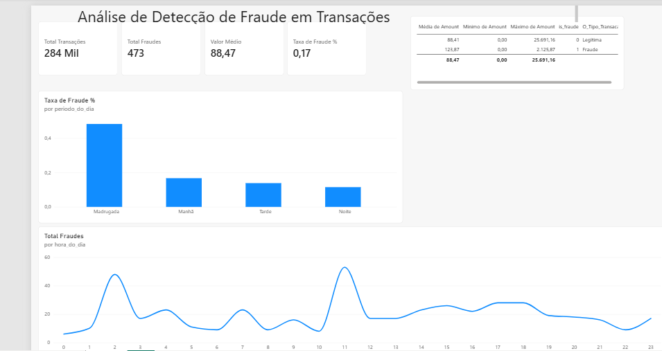

# Pipeline de dados e modelo

Sobre o projeto

Este dashboard apresenta uma visão geral de transações financeiras, com foco na identificação de padrões de fraude, incluindo:

Volume total de transações e fraudes detectadas
Valor médio das transações
Taxa de fraude por período do dia (madrugada, manhã, tarde, noite)
Distribuição de fraudes por hora do dia
Métricas principais
Total de Transações: 284 mil
Total de Fraudes: 473
Valor Médio: R$ 88,47
Taxa de Fraude: 0,17%
Fonte de dados

Os dados são consumidos diretamente do Databricks, via conexão nativa do Power BI, garantindo atualização integrada com o pipeline de dados.

Pipeline de dados e modelo

O projeto segue a arquitetura medalhão (bronze / silver / gold) no Databricks:

Bronze: dataset original de fraude em cartão de crédito (Kaggle, mlg-ulb/creditcardfraud) carregado como tabela Delta
Silver: remoção de duplicatas reais, criação de identificador único por transação
Gold: features numéricas normalizadas (Amount e Time escalados), prontas para o modelo
Modelo de Machine Learning
Algoritmo: Random Forest Classifier (PySpark MLlib)
Features: variáveis V1–V28 (componentes PCA do dataset original) + Amount e Time escalados
Split: 80% treino / 20% teste
Rastreamento: MLflow, com registro de versões no Unity Catalog
Critério de promoção: o modelo só é promovido para produção se atingir AUC-PR ≥ 0.80
Camadas finais para o dashboard
dim_tempo: dimensão de tempo com período do dia (madrugada, manhã, tarde, noite)
fato_transacoes: fatos de transações com indicador de fraude (otimizada com Z-Order por is_fraude)

O Power BI se conecta a essas tabelas finais no Databricks para alimentar os visuais.

Metodologia da análise

O projeto partiu do dataset público de fraude em cartão de crédito (Kaggle), carregado no Databricks como tabela Delta na camada bronze.

Na etapa de exploração, foram verificados a proporção entre transações legítimas e fraudulentas (extremamente desbalanceada), a presença de valores nulos, e o comportamento da variável Amount (valor da transação) e Time (tempo em segundos desde a primeira transação).

Também foi feita uma investigação de duplicatas: usando janelas de agrupamento (ROW_NUMBER) sobre todas as colunas relevantes, foram identificados e removidos registros duplicados reais, mantendo apenas uma cópia de cada transação — o resultado ficou registrado na camada silver.

A partir da camada silver, as features numéricas (V1 a V28, resultado de uma transformação PCA já presente no dataset original, além de Amount e Time) foram normalizadas com StandardScaler, compondo a camada gold usada para treinar o modelo.

Para a análise temporal, o campo Time foi convertido em hora do dia (0 a 23) e agrupado em períodos (madrugada, manhã, tarde, noite), permitindo comparar a taxa de fraude entre esses períodos — resultado que aparece no gráfico "Taxa de Fraude % por período do dia" do dashboard.

Por fim, foram criadas tabelas dimensionais (dim_tempo) e de fatos (fato_transacoes) otimizadas para consumo direto pelo Power BI, conectado ao Databricks.

Tecnologias utilizadas
Power BI Desktop
Databricks
Power Query
DAX
PySpark / MLflow
Como usar
Abra o arquivo .pbix no Power BI Desktop
Configure a conexão com o workspace do Databricks (credenciais/cluster)
Atualize os dados
Explore os visuais interativos
Observações

Os dados utilizados neste projeto são [fictícios / anonimizados] e servem apenas para fins de demonstração e estudo.
